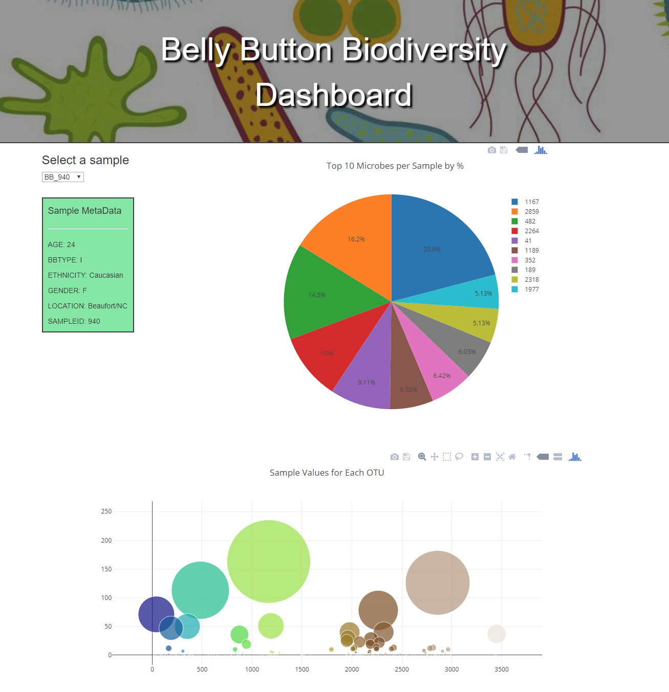

# Belly Button Biodiversity Dashboard

This project built a web dashboard that displays results dynamically from the [Belly Button Diveristy dataset](http://robdunnlab.com/projects/belly-button-biodiversity/).

## Components:
* sqlite database file of the dataset
* Flask and SQLALchemcy to make SQL queries from the database and serve up the results in json format
* Dropdown selector to let users choose which sample from the dataset to view
* Plotly to build a pie and bubble chart to display the selected sample's results (microbial counts)

Here an image from the output to the web site built from scraped elements.

